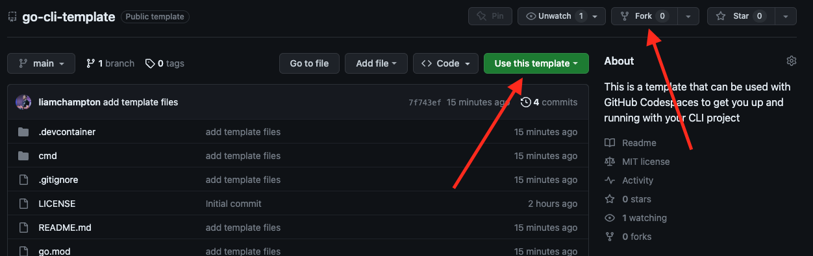
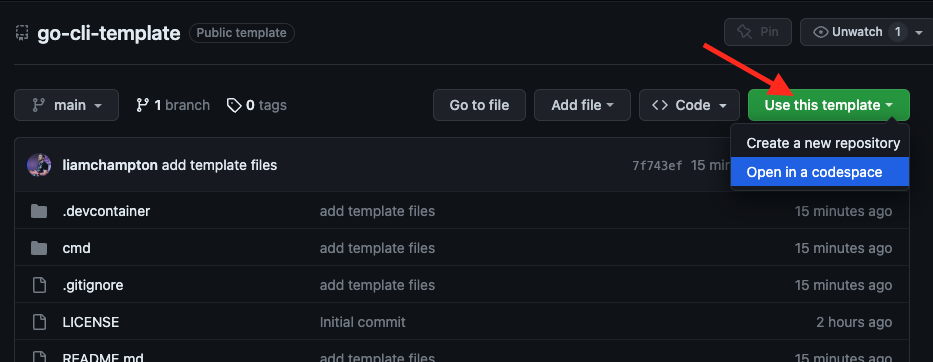
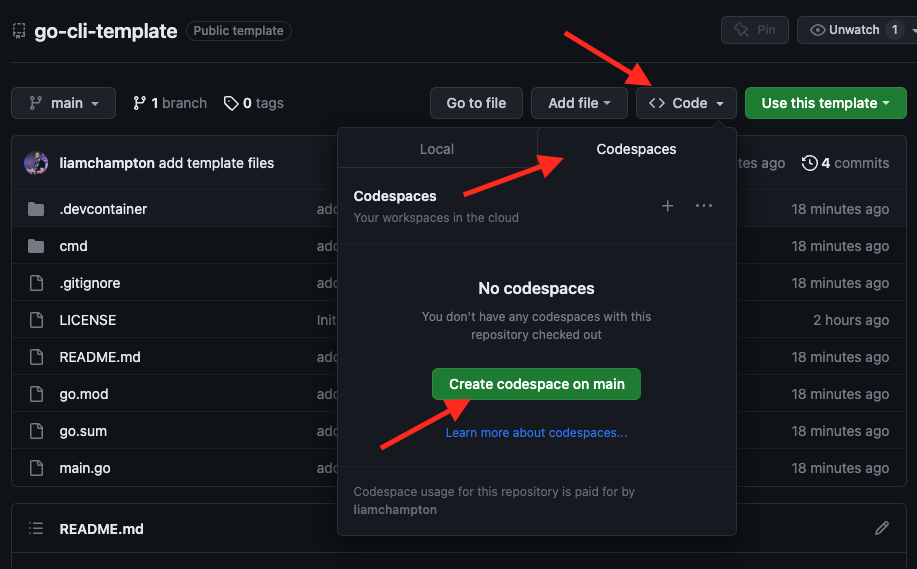
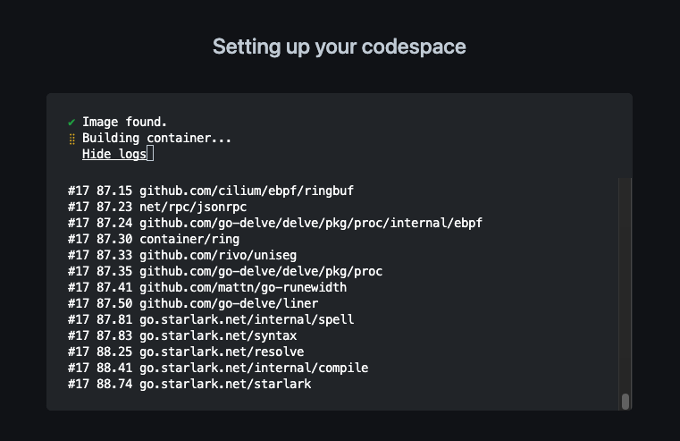
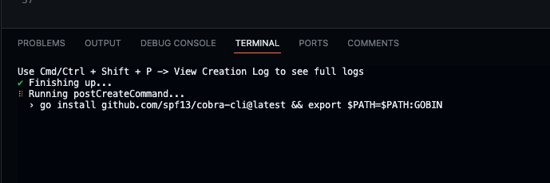
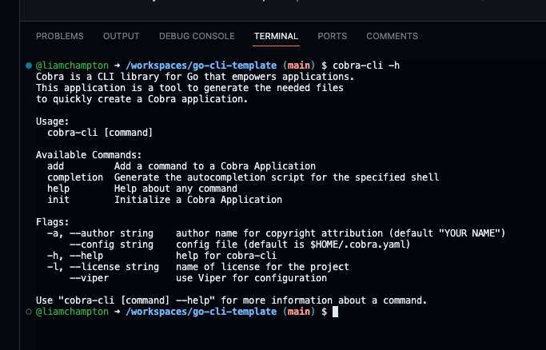

# go-cli-template
This is a template that is designed to be used with GitHub Codespaces to get you up and running with your CLI project in a matter of minutes.

This project is using https://github.com/spf13/cobra as a foundation.

## Getting started

To get started, first you need to decide if you want to `fork` or `template` this repository. In simple terms, with a fork you will have a copy of this repository in your own GitHub account and you can make changes to it as you wish, as well as the ability to pull any updates made from this top level template repository. With a template, you will have a copy of this repository in your own GitHub account as it stands in its current form. You will be able to make changes to the code and make the project your own, but you will not be able to push those changes back to this template repository.

### Forking / Templating



### Creating a codespace

Once you have your own copy of this repository, you can create a codespace by clicking the green `Code` button and selecting `New Codespace`.



OR



Once you have chosen your method, you will be presented with a screen that looks like this:



Wait for this to finish and you will be presented with a screen that looks like VSCode, but in your browser.

Once this has opened you will need to wait just a moment longer for the post create command to finish setting up the environment. You will know this is done when you see the following in the terminal:



Once this is done, you are ready to start coding!

## Running out of the box
run the commands:

```bash
go build
./go-cli-template
```

## Commands

So far there is only 1 command created, `example` and this can be seen within the `/cmd` directory.

The pre-installed Cobra CLI tools can help make your project far more extensible with little work.

To see the commands available with Cobra, run the command: 

```bash
cobra-cli -h
```

This will show you the following output:



### Adding a new command

Adding a new command at the root level is very easy to do, you just need to use the following command:

```bash
cobra-cli add <name of new command>
```

Once you have done this, navigate to the new command within the `/cmd` directory and edit the boilerplate code provided for your needs.

This is a basic foundation for you to build ontop of without the hassel of setup. Adding flags and subcommand palletes is bespoke to your own projet and information on how to do that can be found in the offical docs - https://pkg.go.dev/github.com/spf13/cobra#section-readme

